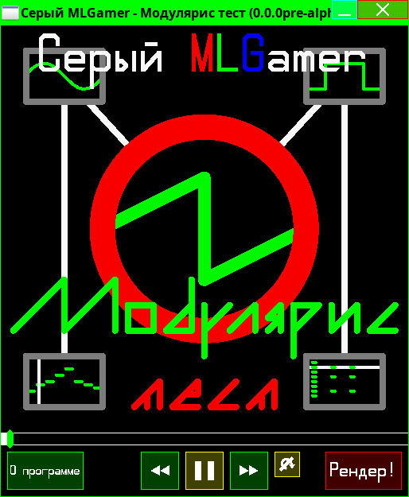

<!--
(C) 2022-2024 Серый MLGamer. All freedoms preserved.
Дзен: <https://dzen.ru/seriy_mlgamer>
SoundCloud: <https://soundcloud.com/seriy_mlgamer>
YouTube: <https://www.youtube.com/@Seriy_MLGamer>
GitHub: <https://github.com/Seriy-MLGamer>
E-mail: <Seriy-MLGamer@yandex.ru>

This file is free documentation: you can redistribute it and/or modify it under the terms of the Creative Commons Attribution-ShareAlike 4.0 International license: <https://creativecommons.org/licenses/by-sa/4.0/>.
This file is distributed in the hope that it will be useful, but WITHOUT ANY WARRANTY; without even the implied warranty of MERCHANTABILITY or FITNESS FOR A PARTICULAR PURPOSE. See the license for more details.
-->

# Modularis Core

This is a free (as in freedom) modular synthesis framework for creation of free digital audio workstations (DAW) and other free programs. [Modularis](https://github.com/Seriy-MLGamer/Modularis) free modular DAW is based on it. Framework is ***fully* crossplatform** between mobile and desktop devices, supports various programming languages.

## Framework essence

### Freedom

Aim of this framework development is to make music art accessible for users of very different devices. Framework architecture is designed with flexibility and extensibility in mind to make possible developing wide range of programs based on this framework. Free license allows users to have benefits from natural information properties: permission to use the framework for any purpose, study and change its work, share the framework.

### Modular synthesis

Synthesizers, effects and control tools are modules that can be connected to other modules at input and output ports. It is more efficient and flexible architecture for music writing than multitrack architecture. Modular synthesis architecture has more potential of performance, multithreading and memory economy.

## Features

### Use in your programs!

*Modularis Core* framework can be used as **player** of music compositions made in programs based on this framework. You can **interact** with them as you programmed it.

### Make your DAW!

*Modularis Core* framework architecture makes it possible to create ***very different* music editors**, be it sequencer DAW, modular synthesizer, tracker or even drum machine!

### Program music!

It is possible to make music using *Modularis Core* framework **without any DAW**. Choose the programming language supported by the framework, create an instance of `Modularis` class, instances of modules, connect them with each other, configure them and **make sound**!

### Connect plugins! (not implemented yet)

*Modularis Core* framework supports **VST3** and **LV2** plugins. It also has its own flexible and extensible plugin system.

### Save your compositions to files! (also not implemented)

*Modularis Core* framework implements **extensible Modularis project file format** based on JSON for possibility of manual editing (just in case). A file contains information about settings and connections of modules. It also can contain information for the DAW the project was created in (or something else). You can create either light file with external dependencies on plugins, samples or something else or heavy, but portable file with embedded dependencies.

# License

Modularis Core is free software: you can redistribute it and/or modify it under the terms of the GNU General Public License as published by the Free Software Foundation, either version 3 of the License, or (at your option) any later version.

Modularis Core is distributed in the hope that it will be useful, but WITHOUT ANY WARRANTY; without even the implied warranty of MERCHANTABILITY or FITNESS FOR A PARTICULAR PURPOSE. See the GNU General Public License for more details.

You should have received a copy of the GNU General Public License along with Modularis Core. If not, see <https://www.gnu.org/licenses/>.

***Only* free** (*as in freedom*) software under the terms of the GNU General Public License can be based on the *Modularis Core* framework.

# The Global Update! The framework has been filled with new features!

## Modularis Core 0.0.0pre-alpha

A lot of new modules have been added and existing modules have been improved.

## Framework contents

  * Modularis

It has feature of singlethreaded sound synthesis. It has "lazy update" mode - modules that are not connected, directly or indirectly, to the Output module are not updated. System sound frame format is 32-bit floating point number.

### Modules

#### Control tools

  * Sequencer

The feature of tone and velocity change has been added. The key "frames" system has been implemented for that. Tone, phase and velocity can be changed independedly on each other. 5 tone and velocity interpolation modes available: `INTERPOLATION_NONE`, `INTERPOLATION_LINEAR`, `INTERPOLATION_FAST`, `INTERPOLATION_SLOW`, `INTERPOLATION_SMOOTH`. Infinite polyphony. Compact data.

The multitrack pattern system has been implemented. There are plans to add several pattern types in order to improve music creation comfort and save memory for slow devices where this library is going to be used.

#### Synthesizers

  * Oscillator

ADSR-envelope support has been added. The module has feature of polyphonic sound playing with one of the 4 waveform types: sine `0`, triangle `1`, saw `2`, square `3`.

  * Sampler

This is the simple sampler with ADSR-envelope, polyphony and loop support and without sample interpolation support. The module is in development, but you can use it.

#### Effects

  * Note_chorus

The note processing effect for supersaws creation.

  * Transpose

Notes transposition.

  * Amplifier

The simple increaser/reducer/phase invertor for sound.

  * Delay

Sound delay. If you make a feedback chain with these modules, you can get an echo effect.

  * Modulator

The amplitude modulation sound effect.

### Ports

  * Note

The port to convey notes.

  * Sound

The port to convey one channel of sound wave.

#### Controllers

  * Integer_controller

The integer controller.

  * Real_controller

The real number controller.

  * ADSR

The real number controllers group: `attack`, `decay`, `sustain`, `release`.

#### System

  * Ports_folder

The ports group that can be connected to other ports and groups or disconnected from them as one.

Now you know about the framework features at this moment. It is time to test them!

## The Guide for Building, Packaging and Testing

### Dependencies

Before starting the following procedures it is required to install these build dependencies:

  * CMake

#### GNU/Linux

  * GCC (recommended; Clang work wasn't tested);
  * Make (or similar program, if it works);

#### Windows

  * mingw32-w64 GCC (recommended; Visual Studio compiler work wasn't tested);
  * mingw32-w64 Make (or similar program, if it works);

### Configuring

Before starting the following procedures you can configure them in "configuration.cmake" file. Configuring tips are in the file.

Then generate the build file using these commands:

#### Bash

	$ mkdir out
	$ cd out
	$ cmake .. -G "Unix Makefiles"

#### CMD

	>mkdir out
	>cd out
	>cmake .. -G "MinGW Makefiles"

### Building

It is done by this command:

#### Bash

	$ make

#### CMD

	>mingw32-make

### Installation

This command will install the framework:

#### Bash

	$ make install

#### CMD

	>mingw32-make install

### Uninstallation

This command will uninstall the framework from the installation folder:

#### Bash

	$ make uninstall

#### CMD

	>mingw32-make uninstall

### Packaging

Packaging is done using CPack utility that is the part of CMake. In order to make package files have right rights in GNU/Linux it is recommended to do packaging as the superuser:

#### Bash

	$ sudo cpack

#### CMD

	>cpack

### Testing

After the procedures above you can test the framework by building and running the test program which uses this framework and is written in C. It contains the player with graphical interface where my new little track plays.

First of all, install the framework (see Installation and also [Releases](https://github.com/Seriy-MLGamer/Modularis_Core/releases) section at GitHub). Then install SDL2, SDL2_image and SDL2_ttf libraries. Your PC must support OpenGL no earlier than version 2.0. After that run this command in "test" folder, if you want to test the player with GUI:

#### Bash

	$ ./test

#### CMD

	>test

Or run this command, if you want to test the player in console mode. It doesn't require neither SDL2_image and SDL2_ttf libraries nor OpenGL support:

#### Bash

	$ ./test-nogui

#### CMD

	>test-nogui

These build scripts expect working with GCC compiler. But, I think, manual test compilation using other compiler with similar compilation arguments will not be a big deal.

If you test in Windows, make sure that headers, static and dynamic library files of SDL2, SDL2_image and SDL2_ttf are in "test" folder or the libraries are added to `PATH` (\<SDL2/SDL2_image/SDL2_ttf root folder>\\bin), `CPATH` (\<SDL2/SDL2_image/SDL2_ttf root folder>\\include) and `LIBRARY_PATH` (\<SDL2/SDL2_image/SDL2_ttf root folder>\\lib) environment variables.

# Enjoy using this framework!