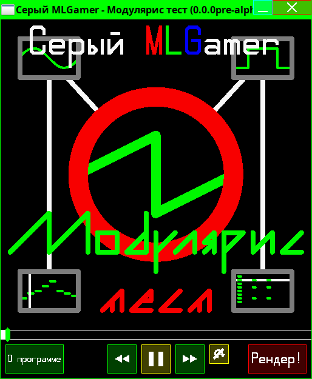

<!--
(C) 2022-2024 Серый MLGamer. Все свободы предоставлены.
Дзен: <https://dzen.ru/seriy_mlgamer>
SoundCloud: <https://soundcloud.com/seriy_mlgamer>
YouTube: <https://www.youtube.com/@Seriy_MLGamer>
GitHub: <https://github.com/Seriy-MLGamer>
E-mail: <Seriy-MLGamer@yandex.ru>

Этот файл - свободная документация: вы можете перераспространять его и/или изменять его на условиях лицензии Creative Commons Атрибуция-СохранениеУсловий 4.0 Всемирной: <https://creativecommons.org/licenses/by-sa/4.0/deed.ru>.
Этот файл распространяется в надежде, что он будет полезен, но БЕЗО ВСЯКИХ ГАРАНТИЙ; даже без неявной гарантии ТОВАРНОГО ВИДА или ПРИГОДНОСТИ ДЛЯ ОПРЕДЕЛЁННЫХ ЦЕЛЕЙ. Подробнее смотрите в лицензии.
-->

# Модулярис Ядро

Это свободный каркас модульного синтеза для создания свободных цифровых рабочих аудиостанций (DAW) и других свободных программ. На нём основана свободная модульная DAW [Модулярис](https://github.com/Seriy-MLGamer/Modularis). Каркас обладает ***полной* кроссплатформенностью** между мобильными и стационарными устройствами, поддерживает различные языки программирования.

## Суть каркаса

### Свобода

Целью разработки этого каркаса является обеспечение доступности музыкального творчества для пользователей самых различных устройств. При проектировании архитектуры каркаса уделяется внимание её гибкости и расширяемости для возможности написания самых различных программ на основе этого каркаса. Свободная лицензия позволяет пользователям получить пользу от естественных свойств информации: возможность использовать каркас в любых целях, изучать и изменять его работу, делиться каркасом.

### Модульный синтез

Синтезаторы, эффекты и инструменты управления ими являются модулями, к которым можно подключать другие модули на их входные и выходные порты. Это является более эффективной и гибкой архитектурой для написания музыки по сравнению с многодорожечной архитектурой. Архитектура модульного синтеза обладает большим потенциалом производительности, многопоточности и экономии памяти.

## Возможности

### Встраивайте в свои программы!

Каркас *Модулярис Ядро* можно использовать в качестве **проигрывателя** произведений, сделанных в программах на основе этого каркаса. С этими произведениями можно **взаимодействовать** запрограммированным вами способом.

### Создавайте свои DAW!

Архитектура каркаса *Модулярис Ядро* позволяет создавать ***самые разные* музыкальные редакторы**, будь то секвенсорный DAW, модульный синтезатор, трекер или даже драм-машина!

### Программируйте музыку!

С помощью каркаса *Модулярис Ядро* возможно написание музыки **без использования DAW**. Выберите язык программирования из поддерживаемых каркасом, создайте объект класса `Modularis`, объекты модулей, соедините их между собой, настройте их и **выводите звук**!

### Поключайте плагины! (пока этого нет)

Каркас *Модулярис Ядро* поддерживает плагины **VST3** и **LV2**, а также собственную гибкую и расширяемую систему плагинов.

### Сохраняйте свои произведения в файлы! (этого пока тоже нет)

Каркас *Модулярис Ядро* реализует **расширяемый формат файла проекта Модулярис**, основанный на JSON для возможности ручного редактирования (на всякий случай). В файле содержится информация о настройках и соединениях модулей, плюс в нём может содержаться информация для DAW, в котором был создан проект (или что-то другое). Есть возможность создания как лёгкого файла с внешними зависимостями от плагинов, сэмплов или чего-то ещё, так и тяжёлого, но портативного файла со встроенными зависимостями.

## Лицензия

Модулярис Ядро - свободное ПО: вы можете перераспространять его и/или изменять его на условиях Стандартной общественной лицензии GNU в том виде, в каком она была опубликована Фондом свободного программного обеспечения; либо версии 3 лицензии, либо (по вашему выбору) любой более поздней версии.

ПО Модулярис Ядро распространяется в надежде, что оно будет полезно, но БЕЗО ВСЯКИХ ГАРАНТИЙ; даже без неявной гарантии ТОВАРНОГО ВИДА или ПРИГОДНОСТИ ДЛЯ ОПРЕДЕЛЕННЫХ ЦЕЛЕЙ. Подробнее см. в Стандартной общественной лицензии GNU.

Вы должны были получить копию Стандартной общественной лицензии GNU вместе с этим ПО. Если это не так, см. <https://www.gnu.org/licenses/>.

С использованием каркаса *Модулярис Ядро* возможно создание только ***только* свободного** программного обеспечения на условиях Стандартной общественной лицензии GNU.

# Масштабное обновление! Каркас наполнился новыми возможностями!

## Модулярис Ядро 0.0.0pre-alpha

Добавлено большое количество новых модулей и усовершенствованы существующие модули.

## Содержание каркаса

  * Modularis

Возможен однопоточный синтез звука. Есть режим "ленивое обновление" - модули, не подключенные прямо или косвенно к модулю Output, не обновляются. Формат системного звукового фрейма - 32-битное число с плавающей точкой.

### Модули

#### Инструменты управления

  * Sequencer

Добавлена возможность плавно менять тон и динамику ноты. Для этого реализована система ключевых "кадров". Тон, фаза и динамика могут меняться независимо друг от друга. Доступно 5 режимов интерполяции для тона и динамики: `INTERPOLATION_NONE`, `INTERPOLATION_LINEAR`, `INTERPOLATION_FAST`, `INTERPOLATION_SLOW`, `INTERPOLATION_SMOOTH`. Неограниченная полифония. Компактность данных.

Реализована многодорожечная система паттернов. В перспективе добавление различных типов паттернов для повышения удобства создания музыки и экономии памяти для слабых устройств, где планируется использоваться эта библиотека.

#### Синтезаторы

  * Oscillator

Добавлена поддержка ADSR-огибающей. Возможно полифоническое проигрывание одного из 4 видов волн: синусоидального `0`, треугольного `1`, пилообразного `2`, прямоугольного `3`.

  * Sampler

Добавлен простенький сэмплер с поддержкой ADSR-огибающей, полифонии и зацикливания и без поддержки интерполяции сэмпла. Модуль в разработке, но пользоваться можно.

#### Эффекты

  * Note_chorus

Эффект обработки нот для создания суперпил.

  * Transpose

Транспозиция нот.

  * Amplifier

Простой усилитель/ослабитель/инвертор фазы звука.

  * Delay

Задержка звука. Если построить цепочку обратной связи с использованием этих модулей, можно получить эффект эхо.

  * Modulator

Эффект амплитудной модуляции звука.

### Порты

  * Note

Порт для передачи нот.

  * Sound

Порт для передачи одного канала звуковой волны.

#### Контроллеры

  * Integer_controller

Целочисленный контроллер.

  * Real_controller

Вещественночисленный контроллер.

  * ADSR

Группа вещественночисленных контроллеров: `attack`, `decay`, `sustain`, `release`.

#### Прочие

  * Ports_folder

Группа портов, которую можно подключать к другим портам и группам и отключать от них как единое целое.

Теперь вы знаете о возможностях каркаса на данный момент. Самое время их испытать!

## Инструкция по сборке, упаковке и тестированию

### Зависимости

Перед началом следующих процедур необходимо установить данные сборочные зависимости:

  * CMake

#### GNU/Linux

  * GCC (рекомендуется; работоспособность Clang не проверена);
  * Make (или подобная программа, если заработает);

#### Windows

  * mingw32-w64 GCC (рекомендуется; работоспособность компилятора Visual Studio не проверена);
  * mingw32-w64 Make (или подобная программа, если заработает);

### Настройка

Перед началом следующих процедур вы можете настроить сборку в файле "configuration.cmake". Подсказки по настройке в файле.

Затем сгенерируйте файл сборки с помощью следующих команд:

#### Bash

	$ mkdir out
	$ cd out
	$ cmake .. -G "Unix Makefiles"

#### CMD

	>mkdir out
	>cd out
	>cmake .. -G "MinGW Makefiles"

### Сборка

Выполняется с помощью следующей команды:

#### Bash

	$ make

#### CMD

	>mingw32-make

### Установка

Данная команда выполнит установку каркаса:

#### Bash

	$ make install

#### CMD

	>mingw32-make install

### Удаление

Данная команда выполнит удаление каркаса из папки установки:

#### Bash

	$ make uninstall

#### CMD

	>mingw32-make uninstall

### Упаковка

Упаковка производится с помощью утилиты CPack - части CMake. Чтобы в GNU/Linux файлы пакета имели правильные права, рекомендуется производить упаковку со сборкой от имени суперпользователя:

#### Bash

	$ sudo cpack

#### CMD

	>cpack

### Тестирование

После вышеперечисленных процедур можно протестировать каркас, собрав и запустив тестовую программу, использующую этот каркас и написанную на C. В ней находится проигрыватель с графическим интерфейсом, в котором проигрывается мой новый небольшой трек.

Для этого сначала установите каркас (см. Установка, а также раздел [Releases](https://github.com/Seriy-MLGamer/Modularis_Core/releases) на GitHub). Затем установите библиотеки SDL2, SDL2_image и SDL2_ttf. Ваш компьютер должен поддерживать OpenGL версии не ниже 2.0. После этого в папке "test" выполните следующую команду, если хотите протестировать проигрыватель с графическим интерфейсом:

#### Bash

	$ ./test

#### CMD

	>test

Либо выполните следующую команду, если хотите протестировать консольный проигрыватель. Для него не нужно устанавливать библиотеки SDL2_image и SDL2_ttf и не нужна поддержка OpenGL:

#### Bash

	$ ./test-nogui

#### CMD

	>test-nogui

Эти сценарии сборки рассчитаны на работу с компилятором GCC. Но, возможно, ручная компиляция теста другим комиплятором с подобными аргументами компиляции не составит большого труда.

При тестировании в Windows убедитесь, что файлы заголовков, статических и динамических библиотек SDL2, SDL2_image и SDL2_ttf находятся в папке "test" либо библиотеки добавлены в переменные среды `PATH` (<корневая папка SDL2/SDL2_image/SDL2_ttf>\\bin), `CPATH` (<корневая папка SDL2/SDL2_image/SDL2_ttf>\\include) и `LIBRARY_PATH` (<корневая папка SDL2/SDL2_image/SDL2_ttf>\\lib).

# Приятного творчества с использованием этого каркаса!